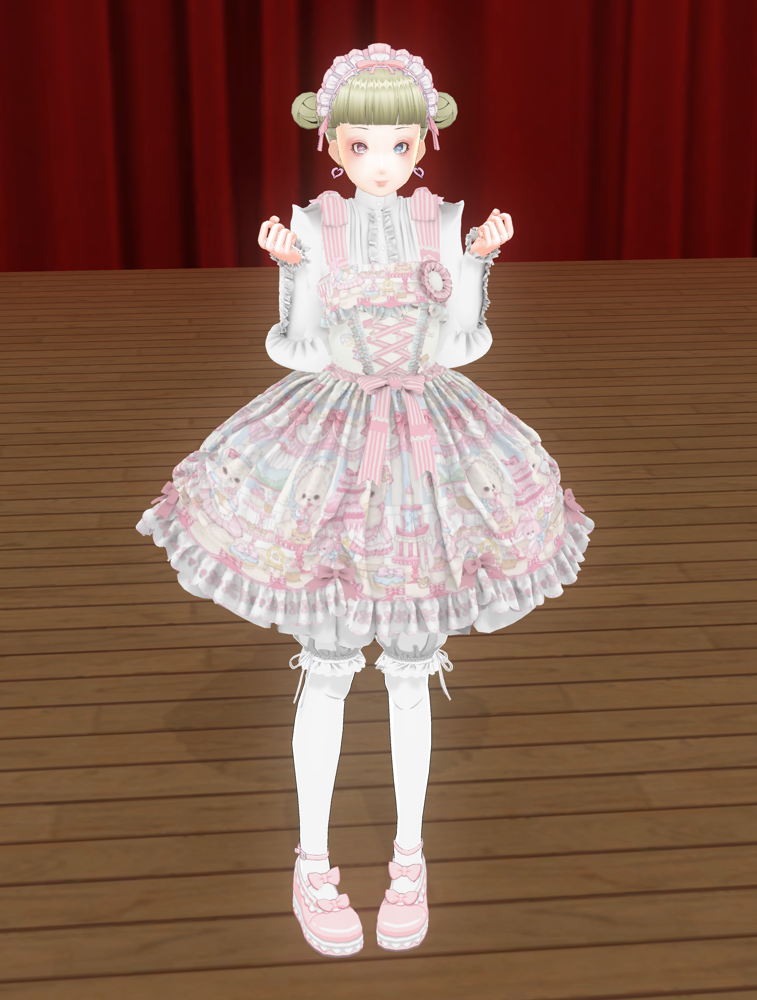

# このMODについて
COM3D2のMODです。ヘッドセット、ブラウス、ドロワーズ、ソックス、靴は付属しません。

modelは水着（リボンなどのパーツを表現）、ワンピース（ベースとなる服を表現）、スカート（パニエを表現）の３つあります。

# 注意点
１つのモデルあたり65000頂点でそれが3つなので全部着せるとそれなりに重たいです

MUNEのシェイプキーを入れていないので貧乳専用です。

画像はPinterestで取ってきたものを使っているので各自差し替えをお願いします。

# テクスチャ差し替え、拡張方法について
※python3以降のインストールとマーベラスデザイナの用意が必要です

1. textureフォルダへ任意のアルファベットの名前でフォルダを作成し、その中にさらにsrcフォルダを作ります。
2. mervelous designerフォルダにあるzprjファイルをマーベラスデザイナで開き、テクスチャを差し替えます
3. UVエディタからテクスチャベイクを行い全てのタイルを1で作ったsrcフォルダへ出力してください。このとき名前は「mydoll12X」としてください。Xには任意のアルファベットが入ります
4. ao_conv.batを実行し、指示に従ってAO付きのtexファイルを作成します。このとき任意のアルファベットが聞かれるので控えておいてください。
5. menu_extendを実行し、指示に従ってmenuを拡張します。
6. mate_extendを実行し、指示に従ってmateを拡張します。

# 適用方法について
右上のCodeからDownload ZIPを選び全体をダウンロードしてからその中にある下記フォルダのみMODフォルダへ移動してください。
- icon
- mate
- menu
- model
- texture
